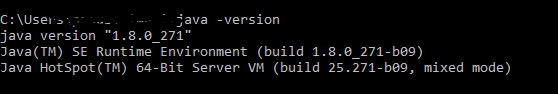

# JAVA SETUP
## Check the JDK

##### Commands to be executed to check the java version
java -version
java -d32 -version
java -d64 -version

#### SET THE ENV VARIABLE in WINDOWS
SET JAVA_HOME

Set the JAVA_HOME to C:\ProgramXX\Java\jdk1.8.0_XX\bin --> depending on if its 32 bit or 64 bit
Add the JAVA_HOME to the PATH variable as well

#### Packages in Java 

#### First method which the JVM will invoke -->
public static void main(string[] args)

#### Compile the java code
 
javac -d ./classes ./source/labs/Helloworld.java

#### Executing the java compiled code

java -cp ./classes labs.Hellworld XXX

#### What are String Builders

#### Wrapper primitives

#### Method Chaining

#### Strings

#### Local Date Time representation in Java
